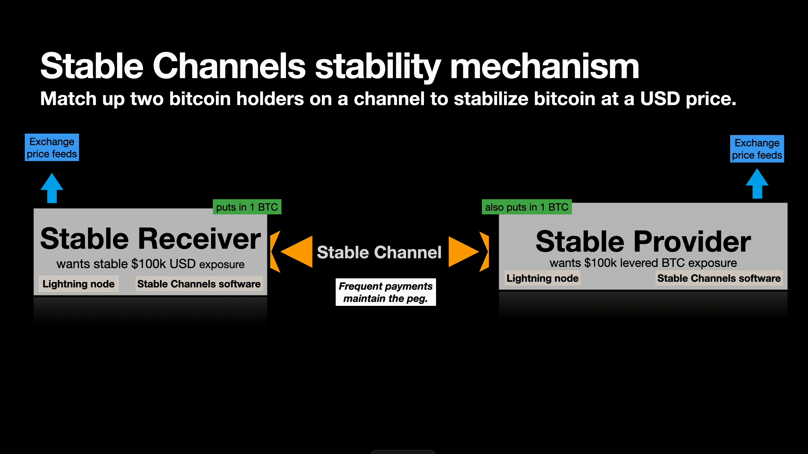

## Stable Channels

Stable Channels is a wallet and technology that lets users peg a portion of their bitcoin to a dollar balance. 

### Downloads
- [macOS (.dmg)](https://github.com/<org>/<repo>/releases/latest/download/app-mac.dmg)
- [Windows (.exe)](https://github.com/<org>/<repo>/releases/latest/download/app-win.exe)
- [Linux (.AppImage)](https://github.com/<org>/<repo>/releases/latest/download/app-linux.AppImage)

The Stable Channels Desktop Wallet runs a full Lightning node that lets users stabilize the money that they send to themselves during onboarding. 

The LSP/Server keeps the user stable by overcollateralizing the Stable Channel at the time of channel creation. Each user (the stability receiver and the the LSP/stability provider) puts in the same amount of bitcoin, the stability mechanism is activated. 

The stability mechanism works like this: each node queries four exchange price feeds every minute. Based on the updated price, they adjust the channel balance with their counterparty to keep the stability receiver's balance at a fixed dollar value (e.g., $100,000 of bitcoin).

  

Both parties remain self-custodial and can opt out anytime via cooperative or forced on-chain channel closure. 

The project is in-progress and is based on LDK Node. Prior versions were compatible with LND and CLN. These legacy implementation can be found in /legacy. 

Links with examples:
- **Basic example:** [Twitter thread](https://x.com/tonklaus/status/1729567459579945017)
- **In-depth discussion:** [Delving Bitcoin](https://delvingbitcoin.org/t/stable-channels-peer-to-peer-dollar-balances-on-lightning)
- **Project website:** [StableChannels.com](https://www.stablechannels.com)

### Run the User Desktop Wallet 

You can check out the latest builds for MacOS, Windows, or Linux here - https://github.com/toneloc/stable-channels/releases

### Run from Source

To run the app from this source, please install Rust on your OS.

Using a fresh Ubuntu? You may need to install OpenSSL libraries. `sudo apt-get install -y pkg-config libssl-dev` and `curl`.

Clone the repo `git clone https://github.com/toneloc/stable-channels` and `cd` into it.

Run `cargo run --bin stable-channels user`. This will start the app on mainnet. Pay the invoice and you are good to go.

Check out logs, key files, and other information in `/data`.

### Stable Channels Process

Every 30 seconds, the price of bitcoin:

- **(a) Goes up:**
  - **Stable Receiver loses bitcoin.**
    - Less bitcoin is needed to maintain the dollar value.
    - The Stable Receiver pays the Stable Provider.
  
- **(b) Goes down:**
  - **Stable Receiver gains bitcoin.**
    - More bitcoin is needed to maintain the dollar value.
    - The Stable Provider pays the Stable Receiver.
  
- **(c) Stays the same:**
  - **No action required.**

*Note: Stable Channels are currently non-routing channels. Work is ongoing to add routing and payment capabilities.*

## Payout Examples (entry = $100,000/BTC)

Each side puts in 1 BTC at $100,0000.

Abbreviations:
- SR = Stable Receiver (targeting $100,000)
- SP = Stable Provider
- Δ = Delta / Change

| Price Change (%) | New BTC Price | SR (BTC) | SR (USD) | SP (BTC) | SP (USD) | SR Fiat Δ$ | SR BTC Δ | SR Fiat Δ% | SR BTC Δ% | SP Fiat Δ$ | SP BTC Δ | SP Fiat Δ% | SP BTC Δ% |
|------------------|---------------|----------|----------|----------|----------|------------|----------|------------|-----------|------------|----------|------------|-----------|
| -30              | 70,000.00     | 1.43     | 100,000.00| 0.57    | 40,000.00| 0.00       | +0.43    | 0%         | +42.86%   | -60,000.00 | -0.43    | -60.00%    | -42.86%   |
| -20              | 80,000.00     | 1.25     | 100,000.00| 0.75    | 60,000.00| 0.00       | +0.25    | 0%         | +25.00%   | -40,000.00 | -0.25    | -40.00%    | -25.00%   |
| -10              | 90,000.00     | 1.11     | 100,000.00| 0.89    | 80,000.00| 0.00       | +0.11    | 0%         | +11.11%   | -20,000.00 | -0.11    | -20.00%    | -11.11%   |
| 0                | 100,000.00    | 1.00     | 100,000.00| 1.00    | 100,000.00| 0.00      | 0.00     | 0%         | 0%        | 0.00       | 0.00     | 0%         | 0%        |
| 10               | 110,000.00    | 0.91     | 100,000.00| 1.09    | 120,000.00| 0.00      | -0.09    | 0%         | -9.09%    | +20,000.00 | +0.09    | +20.00%    | +9.09%    |
| 20               | 120,000.00    | 0.83     | 100,000.00| 1.17    | 140,000.00| 0.00      | -0.17    | 0%         | -16.67%   | +40,000.00 | +0.17    | +40.00%    | +16.67%   |
| 30               | 130,000.00    | 0.77     | 100,000.00| 1.23    | 160,000.00| 0.00      | -0.23    | 0%         | -23.08%   | +60,000.00 | +0.23    | +60.00%    | +23.08%   |

### Acknowledgements

Thanks to countless open-source bitcoin developers and organizations who have made this work possible. Satoshi Lives!

Thanks to all of the Lightning Network core developers, and all of the bitcoin open-source devs on whose giant shoulders we stand. 
