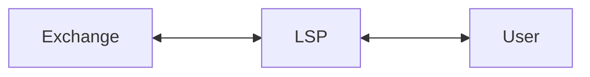

# Stable Channels Rust + LDK + just-in-time channels

## Actors / roles in this demo

In this demo we'll show some interactions between LDK nodes running Stable Channels software.

There are three actors. Each actor runs a Lightning Development Kit (LDK) Lightning Node. 

Each actor remains self-custodial.

1. **Exchange**: Lightning-enabled exchange, like Coinbase or Kraken.
2. **User**: This self-custodial user wants the USD stability, also known as the Stable Receiver.
3. **LSP**: "Lightning Service Provider." This actor is the Stable Provider.

## Prerequisites:
1. Install Rust - https://www.rust-lang.org/tools/install
2. Clone the repo:

``git clone https://github.com/toneloc/stablechannels``

and 

``cd stable-channels``

## Walkthrough:

In this example, a user onboards to a Stable Channel from an exchange. 

The user onboards by paying a Lightning invoice. The LSP creates this channel for the user and provides this stabiltiy service.

## Step 1 - Start the app

``cargo run``

### Step 2 - Get Some test BTC
Run the following commands to get your test Bitcoin addresses:

``exchange getaddress``

and 

``lsp getaddress``

Go to https://faucet.mutinynet.com/ and send some test sats to these two addresses. Wait for them to confirm. 

``exchange balance``

and 

``lsp balance``

### Step 3 - Open a routing channel

Open a channel between the exchange and the LSP. We will use this for routing.

``exchange openchannel``

Let's see if the channel got confirmed on the blockchain. Check if "channel_ready" equals "true."

``exchange openchannel``

and 

``lsp listallchannels``

### Step 4 - Create a JIT Invoice

Create a JIT invoice that will route from the exchange, through the Lightning Service Provider, and finally to the user. 

``user getjitinvoice``

### Step 5 - Pay the JIT Invoice

The LSP intercepts the payment, takes out a channel open fee, puts in matching Liquidity, and sends the rest to the user.

``exchange payjitinvoice``

Now the LSP has two channels. 1 to the exchange and one to the user.

``lsp listallchannels``

And the user has one channel:

``user listallchannels``

### Step 6 - Start a stable channel 

Using the command:

``user startstablechannel CHANNEL_ID IS_STABLE_RECEIVER EXPECTED_DOLLAR_AMOUNT EXPECTED_BTC_AMOUNT``

or:

``user startstablechannel cca0a4c065e678ad8aecec3ae9a6d694d1b5c7512290da69b32c72b6c209f6e2 true 4.0 0``

