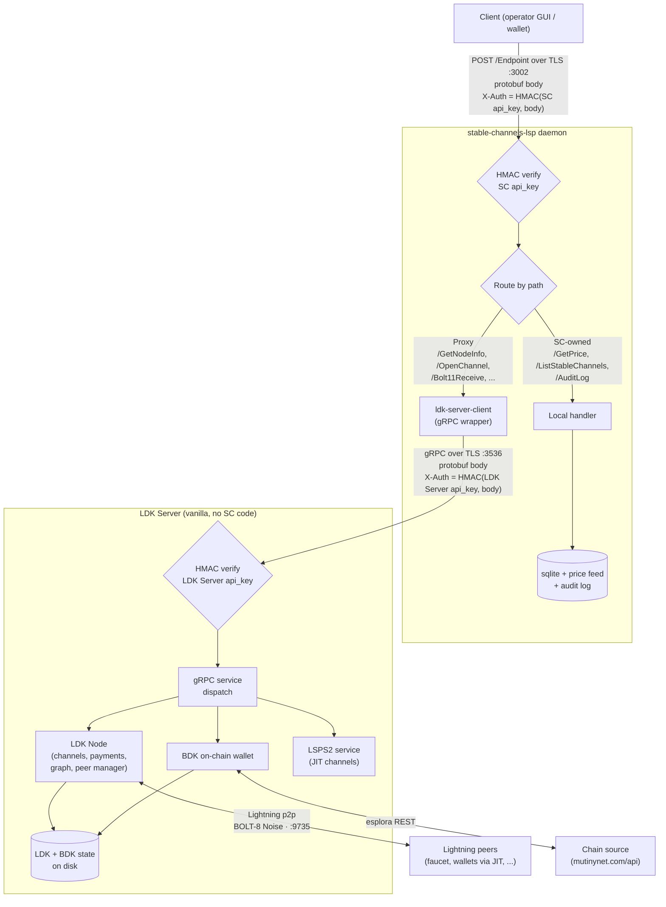

# server/

Cargo workspace for the **Stable Channels LSP** bidaemon architecture, under active development.

## Architecture



`stable-channels-lsp` proxies node-level calls to LDK Server over gRPC and serves SC-specific data (price feed, stable channel records, audit log) directly. LDK Server stays vanilla.

### Clients

Two parallel client classes talk to the SC daemon's REST API:

- **Operator GUI** (`lsp-server-gui`) for admin tasks: channel management, on-chain funds, audit log.
- **Wallet apps** (desktop, iOS, Android) for end-user receive/send.

They are **peers, not chained**. Both are equal clients of the same REST surface. The operator GUI is not "in front of" the wallet apps.

### Auth model

Each connection (client → SC daemon, *and* SC daemon → LDK Server) is secured by three pieces of provisioning data:

| Item | Role |
|---|---|
| **API URL** | Where the listener is (`https://127.0.0.1:3002` for the SC daemon, `127.0.0.1:3536` for LDK Server gRPC). |
| **api_key** | 32-byte shared secret. Used as the key in `HMAC-SHA256(api_key, request_body)`. The resulting HMAC goes in the `X-Auth` header on every request. **The key itself never travels on the wire after provisioning.** This is what authenticates the **client to the server**. |
| **TLS certificate** | The server's self-signed cert, **pinned** by the client. Authenticates the **server to the client** and encrypts the channel. |

So three jobs, three mechanisms: HMAC proves who's calling, cert pinning proves who's answering, TLS encrypts the bytes in between.

The two hops use **independent pairs** of (api_key, TLS cert):

- Hop 1 (client → SC daemon): the SC daemon's api_key + the SC daemon's TLS cert.
- Hop 2 (SC daemon → LDK Server): **LDK Server's own** api_key + **LDK Server's own** TLS cert.

A leak on either hop is contained. A leaked SC daemon api_key (on a wallet, on the operator GUI host, anywhere) gives the attacker access only to the SC daemon, not to LDK Server, because LDK Server only trusts its own key. Symmetrically, leaking LDK Server's key (e.g., off the host running both daemons) reveals nothing about any wallet's traffic.

**How the SC daemon obtains LDK Server's secrets**: at startup the SC daemon reads LDK Server's own config file (path set in `sc-config.toml` under `[ldk_server] config_path`), derives the api_key file and TLS cert paths from it, and loads both into memory. Both daemons therefore need read access to a shared filesystem, usually the same host (Umbrel, VM, etc.). To split them across hosts, those two files have to be shipped over a separate secure channel, or the transport upgraded to mTLS.

## Crates

| Crate | Source | Role |
|---|---|---|
| `stable-channels-lsp/` | local | The daemon. axum REST server, HMAC auth, `ldk-server-client` wrapper. |
| `sc-protos/` | local | Hand written `prost` types for SC specific REST endpoints, plus route path constants. |
| `sc-rest-client/` | local | REST client library, linked into the GUI and consumed by mobile wallet apps. WASM compatible. |
| `lsp-server-gui/` | local | Native + WASM egui GUI. Talks to `stable-channels-lsp` over REST. |
| `ldk-server-client` | LDK Server (`lightningdevkit/ldk-server`) | gRPC client used by `stable-channels-lsp` to dial LDK Server. Pinned to upstream via cargo git rev. |
| `ldk-server-grpc` | LDK Server (`lightningdevkit/ldk-server`) | Wire types for LDK Server's gRPC surface (`GetNodeInfoRequest`, `Channel`, etc.). Pulled in transitively via `ldk-server-client`. |
| `stable-channels` (root crate) | local | Shared utility lib (`db`, `audit`, `price_feeds`, `constants`). Path dep'd by the daemon. |

## Run the stack on Mutinynet (signet)

[Mutinynet](https://mutinynet.com/) is a public signet variant with ~30s blocks and a faucet at <https://faucet.mutinynet.com/>. It's the recommended way to bring up the full stack (LDK Server + SC daemon + operator GUI + desktop wallet) end to end without spending real bitcoin. The setup is **four terminals**. All commands assume `bash`/`zsh`.

### 1. Clone both repos

```bash
git clone https://github.com/toneloc/stable-channels.git
git clone https://github.com/lightningdevkit/ldk-server.git
```

They can live anywhere on disk in any layout. Cargo pulls `ldk-server-client` from upstream at a pinned rev, so no sibling-directory requirement.

### 2. Configure LDK Server

In `ldk-server/contrib/ldk-server-config.toml`:

```toml
[node]
network = "signet"

[esplora]
server_url = "https://mutinynet.com/api"

[liquidity.lsps2_service]
channel_opening_fee_ppm      = 0
min_channel_opening_fee_msat = 0
min_payment_size_msat        = 1000000

[tor]
proxy_address = "127.0.0.1:9050"
```

For the LdkLog route to return content, set `[log] file = "/some/path/ldk-server.log"` in the same config so a file exists to tail.

Comment out the `[bitcoind]`, `[electrum]`, and `[liquidity.lsps2_client]` blocks. The `[tor]` block must stay uncommented even if Tor isn't running.

### 3. Configure the SC daemon

```bash
cd stable-channels
cp server/stable-channels-lsp/example-config.toml ./sc-config.toml
```

Edit `sc-config.toml`:

```toml
network = "signet"
config_path = "/absolute/path/to/ldk-server/contrib/ldk-server-config.toml"
```

`config_path` is how the SC daemon discovers LDK Server's TLS cert and api_key.

For push notifications, add an optional `[push]` section with `apns_*` and `fcm_service_account_path` fields. Each is optional. Missing credentials disable that sender and log a warning at startup, but `RegisterPush` keeps working. See `server/stable-channels-lsp/example-config.toml` for the full schema.

### 4. Configure the desktop wallet

In `stable-channels/src/constants.rs`:

```rust
pub const DEFAULT_NETWORK: &str = "signet";
pub const DEFAULT_CHAIN_URL: &str = "https://mutinynet.com/api";
pub const FALLBACK_CHAIN_URL: &str = "https://mutinynet.com/api";
pub const DEFAULT_LSP_PUBKEY: &str = "<LSP_NODE_ID>";   // fill in after step 5
pub const DEFAULT_LSP_ADDRESS: &str = "127.0.0.1:9735";
```

`<LSP_NODE_ID>` comes from LDK Server's startup log line `Starting up LDK Node with node ID ...`. Launch the LSP first (step 5, terminal 1), copy the ID, paste it here, then build the wallet (terminal 4).

### 5. Launch the four services

```bash
# Terminal 1: LDK Server (LSPS2 service feature is required for JIT channels)
cd /path/to/ldk-server
cargo run --release -p ldk-server --features experimental-lsps2-support -- contrib/ldk-server-config.toml

# Terminal 2: SC daemon
cd /path/to/stable-channels
cargo run --release -p stable-channels-lsp -- sc-config.toml

# Terminal 3: Operator GUI
cargo run --release -p lsp-server-gui

# Terminal 4: Desktop wallet (after pasting the LSP node ID into src/constants.rs)
cargo run --release --bin stable-channels
```

First builds take a few minutes. Subsequent runs are seconds.

### 6. Run the full Lightning flow

In the operator GUI, then the wallet:

1. **Load Config** → **Connect** (status turns green).
2. **Onchain** tab → **Get Address** → copy the `tb1q...` address.
3. <https://faucet.mutinynet.com/> → on-chain section → paste address → request ≥ 100,000 sats → wait ~1 block.
4. The faucet's Lightning node URI is in the form `<pubkey>@<host:port>`. As of writing:
   - **Node ID (pubkey):** `02465ed5be53d04fde66c9418ff14a5f2267723810176c9212b722e542dc1afb1b`
   - **Address:** `45.79.52.207:9735`

   If the faucet has rotated keys since, grab the current values from the faucet site.
5. **Channels** tab → Connect Peer → paste the Node ID and Address from step 4 → **Connect**.
6. **Channels** tab → Open Channel → same Node ID and Address, channel amount `50000` sats → **Open Channel** → wait ~90s for `is_channel_ready = true`.
7. **Lightning** tab → **Spontaneous Payment (Keysend)** → Recipient = faucet Node ID, Amount = `30000000` **msat** (= 30,000 sats, multiply sats by 1,000 since the field is in msat) → **Send**. This pushes sats to the faucet's side of the channel so the LSP has inbound capacity.
8. In the **wallet** onboarding screen: **Add Bitcoin** → **Fixed amount** (use Fixed on Mutinynet, enter ≥ 1000 sats) → **Receive**.
9. Copy the `lntbs1...` invoice from the wallet's QR screen.
10. Faucet site → Lightning section → paste invoice → **Pay**.
11. The LSP opens a JIT channel to the wallet on the fly and forwards the HTLC. Verify in the operator GUI: **Channels** now shows two channels (faucet + wallet), and **Forwarded Payments** shows the routed HTLC. The wallet balance updates.

### Other networks

For regtest or mainnet, the same shape applies: swap `network = "signet"` in both config files, swap the esplora URL (or activate `[bitcoind]` / `[electrum]` instead) in LDK Server's config, and update `DEFAULT_CHAIN_URL` + `FALLBACK_CHAIN_URL` in `src/constants.rs`. Drop the zero-fee LSPS2 values when you're not just testing.
